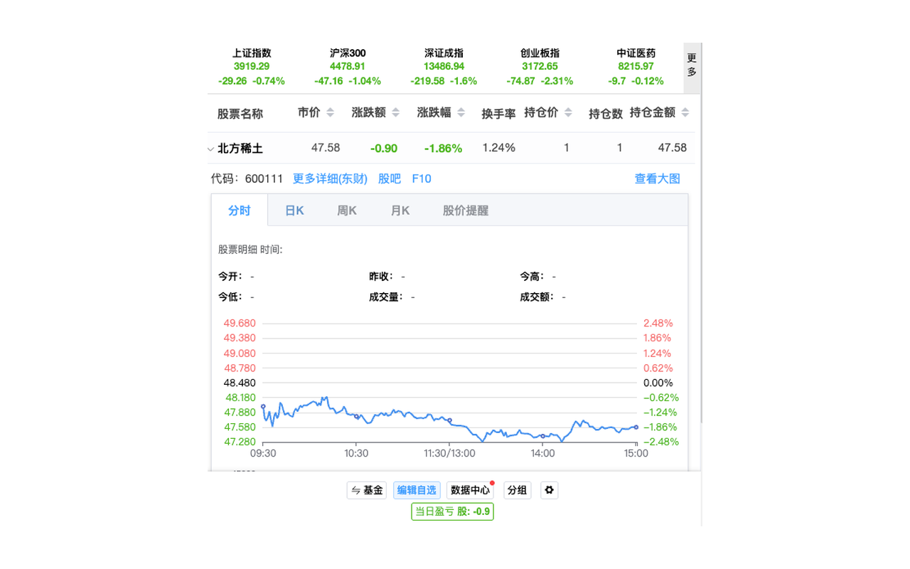
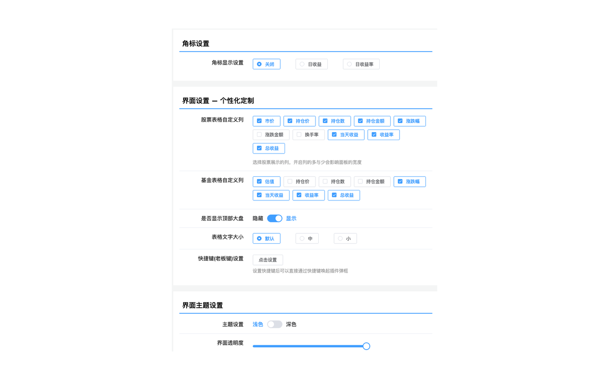

# 股票基金助手 V3（免费版）

> 股票助手 | 基金助手 | 盯盘助手 | Chrome 扩展 | Chrome 插件 | 浏览器插件 | A股 | 沪深股市 | 港股 | 美股 | 基金估值 | 基金净值 | 实时行情 | 股票行情 | 自选股 | 自选基金 | 涨跌提醒 | 股票提醒 | 摸鱼炒股 | 摸鱼神器 | 免费股票插件 | 开源股票助手 | stock assistant | fund assistant | chrome extension

一款免费开源的基金股票盯盘扩展适配最新的Chrome浏览器，帮助你在浏览器中便捷查看股票、基金的实时行情数据。支持 A 股沪深港美股、基金估值、自选管理、实时盯盘、涨跌提醒，打工人炒股摸鱼神器。

## 截图预览

| 股票行情面板 | 设置页面 |
|:---:|:---:|
|  |  |

## 功能特性

- 实时查看股票、基金行情数据
- 支持自选股/基金管理
- 角标设置、界面自定义
- 消息通知提醒
- 数据备份与恢复
- 行情详情页面

## 安装方式

### 方式一：Chrome 应用商店安装（推荐）

直接从 [Chrome 应用商店](https://chromewebstore.google.com/detail/kkpggfodnhcpnmpajjbfckcpjmfabnak) 安装，自动更新，省心省力。

### 方式二：手动安装

1. 下载本仓库代码（点击右上角绿色 **Code** 按钮 → **Download ZIP**）
2. 解压到任意文件夹
3. 打开 Chrome 浏览器，地址栏输入 `chrome://extensions/`
4. 开启右上角 **开发者模式**
5. 点击 **加载已解压的扩展程序**，选择解压后的文件夹
6. 扩展安装完成，点击工具栏图标即可使用

## 说明

本项目基于 [股票基金助手-盯盘助手](https://chromewebstore.google.com/detail/%E8%82%A1%E7%A5%A8%E5%9F%BA%E9%87%91%E5%8A%A9%E6%89%8B-%E7%9B%AF%E7%9B%98%E5%8A%A9%E6%89%8B/folafkamgdbhdeejjhohajojeogpoknm/reviews) 修改而来，感谢原作者 **Pushu** 的开发与贡献！

本版本移除了登录注册、打赏付款等相关内容，**完全免费**，方便大家直接使用。

> ⚠️ **注意：** 本项目是直接基于原扩展打包编译后的产物进行修改的，并非原始源码。代码经过 Webpack 打包压缩，可读性较差，不适合作为二次开发的基础。如果你只是想安装使用，直接按上方安装方式操作即可。

## 参与贡献

欢迎大家一起参与开发和维护！现在 AI 辅助编程已经很成熟了，即使是编译后的代码也可以借助 AI 来理解和修改。

如果你有新功能、Bug 修复或版本更新需要提交，可以通过以下方式联系我：

- 📧 邮箱：**gshifu3303@gmail.com**
- 💬 提交 [Issue](../../issues) 或 [Pull Request](../../pulls)

期待你的参与！

## License

本项目仅供学习交流使用。原始版权归原作者所有。
